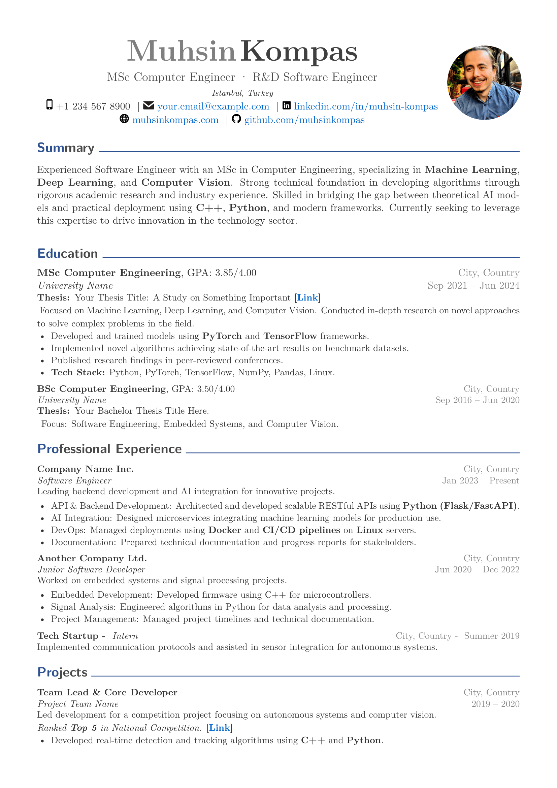
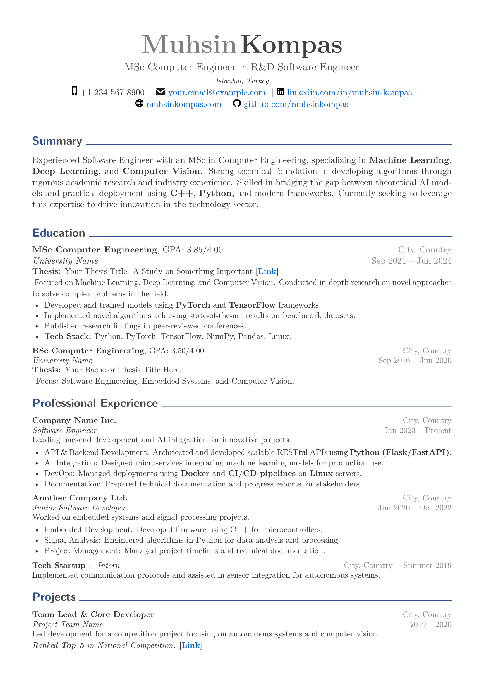

# ATS-Friendly LaTeX Resume Template

A professional, customizable, and ATS (Applicant Tracking System) friendly resume template built with LaTeX and XeLaTeX.


## ✨ Features

- **ATS-Friendly**: Clean structure without complex graphics that confuse ATS systems
- **Customizable Colors**: Easy color configuration via hex values
- **Custom Font Support**: Load fonts from `./fonts` folder using XeLaTeX
- **Right-Justified Dates**: Dates and locations aligned to the right
- **Two-Color Section Headers**: First letters in primary color, rest in secondary color
- **Bold Keywords**: Highlight important terms with `\bold{keyword}`
- **Profile Photo Support**: Optional circular profile photo
- **SVG Icons**: Support for custom icons in header
- **Modular Design**: Easy-to-use commands for each section type

## 📸 Preview

<p align="center">
  
  &nbsp;&nbsp;
  
</p>

<p align="center">
  <em>Left: With Photo Layout</em> &nbsp;&nbsp;&nbsp;&nbsp;&nbsp;&nbsp;&nbsp;&nbsp;
  <em>Right: Without Photo Layout</em>
</p>

> 📄 **[View Full PDF Example](resume.pdf)**

### Layout Options

| Feature | With Photo | Without Photo |
|:--------|:----------:|:-------------:|
| Command | `\makeheaderwithphoto` | `\makeheader` |
| Photo | Circular photo on right | No photo |
| Contact Info | Left-aligned with icons | Centered with bullets |
| Best For | Creative/Design roles | Traditional/Corporate |

To switch between layouts, comment/uncomment the appropriate header command in `resume.tex`:

```latex
% Option 1: WITHOUT photo (centered layout)
%\makeheader
%    {Your Name}
%    {Your Title}
%    ...

% Option 2: WITH photo (side-by-side layout)
\makeheaderwithphoto
    {Your Name}
    {Your Title}
    ...
    {profile.jpeg}    % Your photo file
```

## 📁 File Structure

```
resume-template/
├── README.md               # This documentation
├── resume.tex              # Main LaTeX template
├── resume.pdf              # Example compiled PDF
├── .gitignore              # Git ignore file
├── profile.jpeg            # Your profile photo (optional)
├── fonts/                  # Custom fonts folder
│   ├── README.md
│   ├── Roboto-Regular.ttf
│   └── ...
├── icons/                  # SVG icons for header
│   ├── README.md
│   ├── iphone.svg
│   ├── envelope.svg
│   ├── linkedin.svg
│   ├── github.svg
│   └── website.svg
└── preview/                # Preview images for README
    ├── with_photo.png
    └── without_photo.png
```

## 🚀 Quick Start

### Prerequisites

- TeX Live or MiKTeX with XeLaTeX
- Required packages: `fontspec`, `geometry`, `xcolor`, `titlesec`, `enumitem`, `hyperref`, `tabularx`, `graphicx`, `tikz`, `svg`

### Compilation

```bash
xelatex resume.tex
xelatex resume.tex   # Run twice for proper hyperlinks
```

Or use the magic comment at the top of the file with your LaTeX editor (e.g., TeXstudio, Overleaf).

## 🎨 Customization Guide

### Colors

Edit the color definitions in the CONFIGURATION section:

```latex
\definecolor{primary}{HTML}{2E5090}       % Section titles, name highlight
\definecolor{secondary}{HTML}{4A4A4A}     % Secondary text color
\definecolor{accent}{HTML}{0066CC}        % Links and highlights
\definecolor{textcolor}{HTML}{333333}     % Main body text
\definecolor{lightgray}{HTML}{888888}     % Dates, locations
```

### Fonts

1. Place your font files (`.ttf`) in the `./fonts` folder
2. Uncomment and modify the font configuration:

```latex
\setmainfont{Roboto}[
    Path = ./fonts/,
    Extension = .ttf,
    UprightFont = *-Regular,
    BoldFont = *-Bold,
    ItalicFont = *-Italic,
    BoldItalicFont = *-BoldItalic
]
```

**Recommended free fonts:**
- [Roboto](https://fonts.google.com/specimen/Roboto)
- [Source Sans Pro](https://fonts.google.com/specimen/Source+Sans+3)
- [Lato](https://fonts.google.com/specimen/Lato)
- [Open Sans](https://fonts.google.com/specimen/Open+Sans)

### Page Layout

Adjust margins in the geometry settings:

```latex
\geometry{
    top=1.5cm,
    bottom=1.5cm,
    left=1.4cm,
    right=1.4cm
}
```

## 📝 Section Commands Reference

### Header (Without Photo)

```latex
\makeheader
    {Your Name}                    % Name
    {Your Title}                   % Title
    {City, Country}                % Address
    {+1 234 567 8900}              % Phone
    {email@example.com}            % Email
    {yourwebsite.com}              % Website (without https://)
    {github-username}              % GitHub username
    {linkedin-username}            % LinkedIn username
```

### Header (With Photo)

```latex
\makeheaderwithphoto
    {Your Name}                    % Name
    {Your Title}                   % Title
    {City, Country}                % Address
    {+1 234 567 8900}              % Phone
    {email@example.com}            % Email
    {yourwebsite.com}              % Website (without https://)
    {github-username}              % GitHub username
    {linkedin-username}            % LinkedIn username
    {profile.jpeg}                 % Photo filename
```

**Two-Color Name Option:**

Inside `\makeheaderwithphoto`, you can customize the name display:

```latex
% Two colors (default):
{\fontsize{32pt}{1em}\bfseries\color{gray}First} {\fontsize{32pt}{1em}\bfseries\color{darkgray}Last}

% Single color (alternative):
{\fontsize{32pt}{1em}\bfseries\color{darkgray} #1}
```

### Colored Section Headers

Split your section name at any point - first part gets primary color, second part gets secondary color:

```latex
\coloredsection{Edu}{cation}           % "Edu" in primary, "cation" in secondary
\coloredsection{Ski}{lls}              % "Ski" in primary, "lls" in secondary
\coloredsection{Pro}{fessional Experience}
\coloredsection{Cer}{tificates}
```

### Summary

```latex
\summary{
Your professional summary text here. You can use \textbf{bold} for keywords
like \textbf{Python}, \textbf{Machine Learning}, etc.
Approximately 100 words recommended.
}
```

### Education

```latex
% With GPA
\educationentry
    {M.Sc. Computer Engineering}       % Degree
    {3.85/4.00}                        % GPA
    {University Name}                  % School
    {City, Country}                    % Place
    {Sep 2021 -- Jun 2023}             % Date

% Without GPA
\educationentrynogpa
    {B.Sc. Computer Engineering}       % Degree
    {University Name}                  % School
    {City, Country}                    % Place
    {Sep 2017 -- Jun 2021}             % Date

% Thesis with link
\thesis{Your Thesis Title Here}{https://link-to-thesis.com}

% Thesis without link
\thesisnolink{Your Thesis Title Here}

% Description paragraph
\entrydescription{Brief description of your focus areas and achievements.}

% Bullet points
\begin{entryitems}
    \item First achievement or responsibility
    \item Second item with \bold{highlighted keywords}
    \item \bold{Tech Stack:} Python, C++, PyTorch, etc.
\end{entryitems}
```

### Professional Experience

```latex
% Two-line format (Company on first line, Title on second)
\experienceentry
    {Company Name}                     % Company
    {City, Country}                    % Place
    {Job Title}                        % Title
    {Jan 2023 -- Present}              % Date

% Single-line format (Company and Title on same line) - great for internships
\experienceentrysingleline
    {Company Name}                     % Company
    {City, Country}                    % Place
    {Job Title}                        % Title
    {Summer 2022}                      % Date

\entrydescription{Brief role description.}

\begin{entryitems}
    \item Key responsibility or achievement
    \item Another accomplishment with \bold{metrics}
\end{entryitems}
```

### Projects

```latex
\projectentry
    {Your Role}                        % Role
    {Team/Organization Name}           % Team
    {City, Country}                    % Place
    {2022 -- 2023}                     % Date

\entrydescription{Project description. \textit{Ranked \textbf{1st Place} in competition.} \textbf{[\href{https://link.com}{\color{accent}Link}]}}

\begin{entryitems}
    \item What you developed or achieved
    \item Technologies and methodologies used
    \item \bold{Tech Stack:} List of technologies
\end{entryitems}
```

### Skills

```latex
\begin{skillstable}
    \skillcategory{Programming}{Python, C++, MATLAB, SQL}
    \skillcategory{AI/ML}{PyTorch, TensorFlow, YOLO, OpenCV}
    \skillcategory{Tools}{Docker, Git, Linux, ROS}
    \skillcategory{Languages}{English (Fluent), German (Basic)}
\end{skillstable}
```

**Adjusting column widths:** Edit the `skillstable` environment definition:
```latex
\begin{tabular}{@{}>{\raggedleft\arraybackslash}p{3.8cm} p{13.2cm}@{}}
%                                              ^^^^       ^^^^^
%                                         Category    Skills list
%                                           width        width
```

### Certificates

```latex
% With link
\certificateentrylink
    {2023}                             % Date
    {Certificate Name}                 % Name
    {Platform -- Instructor}           % Course - Institution
    {https://certificate-link.com}     % Link

% Without link
\certificateentry
    {2022}                             % Date
    {Certificate Name}                 % Name
    {Platform -- Instructor}           % Course - Institution
```

## 💡 Tips & Tricks

### Bold Keywords

Use `\bold{keyword}` or `\textbf{keyword}` to highlight important terms:

```latex
\item Developed \bold{real-time lane detection} using \bold{OpenCV} and \bold{Python}
```

### Adding Inline Links

```latex
\textbf{[\href{https://your-link.com}{\color{accent}Link Text}]}
```

### Escaping Special Characters

Remember to escape these characters in LaTeX:

| Character | Escape |
|:---------:|:------:|
| & | `\&` |
| % | `\%` |
| $ | `\$` |
| # | `\#` |
| _ | `\_` |
| { | `\{` |
| } | `\}` |

### Adding Custom Icons

1. Place SVG files in the `./icons` folder
2. Use `\includesvg[height=1.0em]{iconname}` in your text

### Commenting Out Sections

Use `%` at the beginning of lines to comment out content you want to hide temporarily.

## 🎯 ATS Optimization Tips

1. **Use standard section headers**: Education, Experience, Skills, Projects, Certificates
2. **Include relevant keywords** from job descriptions
3. **Keep formatting simple** - this template uses tables only for alignment
4. **Save as PDF** for submission to preserve formatting
5. **Avoid graphics in main content** - keep them in header only
6. **Use full words** instead of abbreviations when possible
7. **Include both acronyms and full terms**: "Machine Learning (ML)"

## 🔧 Troubleshooting

### Compilation Errors

- Ensure XeLaTeX is installed: `xelatex --version`
- Check for unescaped special characters: `&`, `%`, `$`, `#`, `_`
- Verify all packages are installed

### Font Issues

- Verify font files are in the correct path (`./fonts/`)
- Check font file names match the configuration exactly
- Try with system fonts first to isolate the issue

### Photo Not Showing

- Ensure the image path is correct and file exists
- Use JPG or PNG format
- Check file permissions
- Verify TikZ package is loaded

### SVG Icons Not Working

- Install Inkscape (required for SVG support)
- Check icons are in `./icons/` folder
- Verify SVG files are valid

## 📄 License

This template is free to use and modify for personal and commercial purposes under the MIT License.

## 🤝 Contributing

Contributions are welcome! Feel free to:
- Submit issues for bugs or feature requests
- Create pull requests with improvements
- Share your customized versions

## ⭐ Support

If you found this template helpful, please consider giving it a star on GitHub!

---

Made with ❤️ using LaTeX
